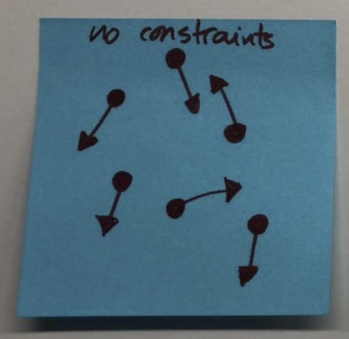

"Do whatever you feel like". This is autonomy. It sounds cool, doesn't it?

But.

Autonomy can also get you running in circles.

## The baseline

This one is easy – to avoid running in circles, a team (or group of them) needs a shared vision, a goal.

Alignment is the stepping stone that enables autonomy. Without it, the result is apathy.

## The paradox

One might think about autonomy as the absence of constraints or limitations.

And I grant you that – having constraints sounds "bad".

We tend to blame constraints when things don't go as expected.

Yet, I try to challenge this assumption and frame them as challenges.

What would a group of people/teams look like when **granted with autonomy**, but also **with no constraints**?

<figure class="figure" style="max-width:360px">
  
  <figcaption>People or teams within a constraint-free environment</figcaption>
</figure>

_(Yes, I actually drew this on a post-it. I was in the middle of a totally unrelated conversation, and I had to pretend I was taking notes)._

## The constraints

Mark Twain once said, "_I didn't have time to write a short letter, so I wrote a long one instead_".

David Ogilvy once said, "_Give me the freedom of a tight brief_".

(These quotes might be fake. I didn't check).

When the surface area for exploration is limited, it forces everyone to focus on the most critical problem.

This is **the art of simplicity**: focus only on the important stuff. Do fewer things. Do what's actually essential. Take away all the irrelevance.

Also, you'll need some slack time so that you can define (and refine) more constraints. You can not have a system mindset with your head stuck in the ground.

This is why starting an essay from a blank page is so damn hard.

<figure class="figure" style="max-width:360px">
  
  <figcaption>People or teams within a constraint-fixed environment</figcaption>
</figure>

### Gimme some examples

Dunno, mate. It depends on your context. Here are some random ideas:

**#1**: deploy software to production every working day.

**#2**: all code should be developed in pairs.

**#3**: a team can only be working on 2 different things simultaneously.

**#4**: any git branch older than two days should be merged or deleted.

**#5**: assume all your users have a shitty internet connection.

**#6**: any web application should load in less than 2 seconds.

Constraints trigger the "How might we…" challenge.

## The expansion

However, there are some flaws with fixed constraints: We never get people (or teams) back if they lose track. Also, they don't strive for improvement.

Without a common ground, there's no baseline where we can agree upon. No way to get back.

What if constraints were incremental? They would expand to allow for growth.

<figure class="figure" style="max-width:360px">
  
  <figcaption>People or teams within a constraint-expanding environment</figcaption>
</figure>

Some of the restrictions might be fundamental. Non-negotiable. Some are built upon each other, so they allow for improvement once the team feels comfortable enough. They can be iterated.

## Too long; didn't read

Autonomy is something worth fighting for. But!

Autonomy requires vision. It also requires constraints.

Get freedom by having focus. And if you are one of those people who lead/manage: Give freedom by giving focus.
