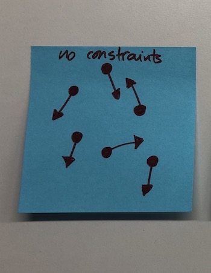

"Do whatever you feel like". This is autonomy. It sounds cool, doesn't it?

But.

Autonomy can also get you running in circles.

Here are a few thoughts on how to foster *useful* autonomy – that is, autonomy that delivers.

## The baseline

The first one is quite obvious. To avoid running in circles, a team (or group of them) needs **a shared vision, a goal** to reach. In short, a direction. Why does the team exist? What does success look like? This helps team members (or, again, several teams) to align towards the goal.

This alignment is **the stepping stone that enables autonomy**. Without it, the result is apathy.

Okay, so we have a clear, shared, engaging vision. Now what?

Now we need limitations.

## The paradox

One might think about autonomy as the absence of limitations (constraints).

What would a group of people/teams look like when **granted autonomy and no constraints**?

<figure class="figure" style="max-width:360px">
  
</figure>

_(Yes, I actually drew this on a post-it. I was in the middle of an unrelated conversation, and I had to pretend I was taking notes)._

It's a free for all.

While movement exists (there's a goal, after all!), it is hard to track progress. Things move, but you might not see **real progress**.

But yeah, I grant you that – constraints sounds "bad". They don't look like a cool thing, and we tend to blame them when things don't go as expected.

What if we thought about constraints as challenges, though?

## The constraints

Mark Twain once said, "_I didn't have time to write a short letter, so I wrote a long one instead_".

David Ogilvy once said, "_Give me the freedom of a tight brief_".

(These quotes might be fake. I didn't check).

Without challenging constraints, **possibilities are endless**. Everything is permitted. Even if you have the guidance of a clear vision, that's not enough.

This is why starting an essay from a blank page is so damn hard. Too many damn options end up leading to paralysis by analysis.

A limited surface area forces everyone to focus creatively on the important stuff.

<figure class="figure" style="max-width:360px">
  
</figure>

It is **the art of simplicity**: do fewer things to do what's essential. Take away all the irrelevance.

### Gimme some constraint examples

Dunno, mate. It depends on your context. Here are some random ideas:

**#1**: deploy software to production every working day.

**#2**: develop all features in pairs.

**#3**: a team can only be working on 2 different things simultaneously.

**#4**: merge or delete any git branch older than two days.

**#5**: assume all your users have a shitty internet connection.

**#6**: any web application should load in less than 2 seconds.

**#7**: all projects (as in "big chunk of work") need to come from a hypothesis to improve a business metric.

Constraints trigger the "How might we…?" mindset.

And please, please. Notice that you'll need some slack time so that you can define (and refine) more constraints. You can not have a system mindset with your head stuck in the ground.

## The expansion

Yet, there are some flaws with fixed constraints: We never get people (or teams) back if they lose track. Also, they don't trigger any improvement.

Without a common ground, there's no baseline where we can agree upon. No way to get back on track.

What if constraints were incremental?

<figure class="figure" style="max-width:360px">
  
</figure>

Here, some restrictions are fundamental. Some are built upon each other: they allow for improvement once everyone feels comfortable enough.

So, next steps:

1) To identify the non-negotiable constraints.
2) To let "rules" evolve: what would a constraint look like a few months from now?

This is left as an exercise to the reader.

## Too long; didn't read

Autonomy is something worth fighting for. But!

Autonomy requires vision. It also requires constraints.

Get freedom by having focus. And if you are one of those people who lead/manage: Give freedom by **giving** focus.
