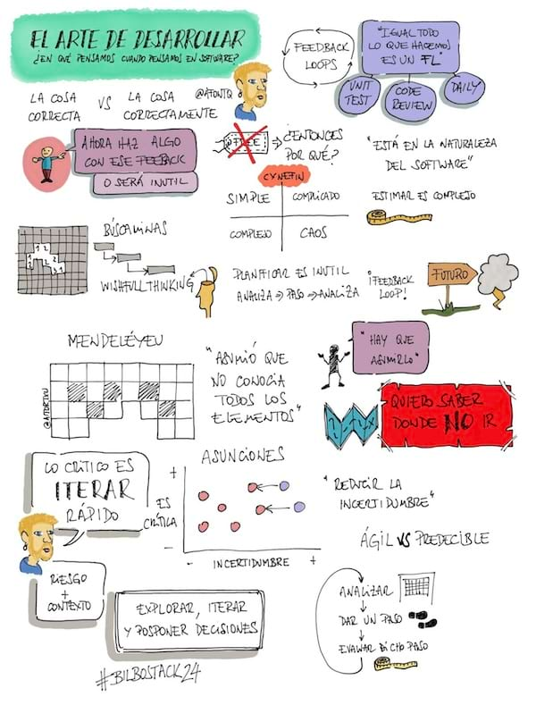

[Bilbostack](https://bilbostack.com) is a unique event, one of the best conferences out there. The talks are great, but its networking is top-notch. One can have fun, but also is a great opportunity to learn from the community.

It's been a while since my last public talk, so I needed to came up with something new. I wasn't sure what to talk about when [Vicenç](https://twitter.com/vgaltes/) and [Fran](https://twitter.com/fran_mosteiro/) invited me to speak there. I had some ideas, but I needed to find something that came from deep inside and based on my experience – I've always thought this is where great talks come from.

And I ended up talking about nothing in particular.

I shared my thoughts around creating software. I introduced some mental models that help me navigate this world.

## And it was challenging

**My views on software have changed recently** due to my switch from product development on a medium-sized company to platform engineering on a _huge-to-gigantic_ company.

Turns out I didn't know The Truth™️. What a surprise, right?!

I thought I knew what software was about, because I knew what I was doing until then. I was well aware of the domain I was working on, knew the tech, and delivered effortlessly. I felt confident and knowledgeable.

But **everything changes when everything changes**.

The new context forced me to rethink. A lot changed, and I struggled to port my old ideas to my new world. The best I could do is to find common ground between my experiences, and see things with a bird's eye view.

And this is what I talked about at Bilbostack.

## What software is about

**Software is about feedback loops**, not matter the size of the company. No matter the company domain, no matter the tools, the processes. We create [feedback loops](https://afontcu.dev/feedback-loops/) all day, and use them to navigate the map of creating a software product.

Software is about understanding that we live surrounded by [unknown unknowns](https://afontcu.dev/embrace-unknowns/), surrounded by things we know they'll change. We know they'll change, but change is inevitable, and planning ahead is pointless.

Thus, software is about *postponing* decisions as much as possible. Since we learn as we move forward, it makes sense to make decisions as late as possible, to do so with the largest amount of information we can get.

You may like or dislike agile, Scrum, Kanban, Jira, Jenkins, DevOps, you name it. Who cares. All that boils down to a simple thing. There is no way around this simple truth:

**Software is iterating – and learning from each iteration**. The software development process is made of tiny iterations that compound into larger ones.

Software is about analyzing the current situation, taking a **small, safe step**, understanding what changed, and starting again.

In my talk, I explained that I envision software development as playing [minesweeper](https://afontcu.dev/minefield/) – a game where you don't plan too much. Instead, you take a step, process the new information from the layout, and act accordingly. You wouldn't prepare a Gantt's diagram to win at minsweeper, would you?

This, my friends, is **software development in a nutshell**.

Software is about choosing between agility and [predictability](https://afontcu.dev/be-predicatble/). You might want both, but that's really hard to achieve. Generally speaking, **companies favor predictability** over everything else.

--

My talk was a collection of analogies and metaphors. I tend to use these tools to explain things. Good metaphors make complex ideas digestible. It has its downsides, because a metaphor is only a metaphor, similarly how [a map is not the territory](https://fs.blog/map-and-territory/). But they are a first step towards new concepts.

I'm grateful to Bilbostack organizers for pushing me back to origins, and forcing me reason about things I was putting off. I did my homework, and it turns out it helped me because connecting the dots always feels like progress.

Anyway, here are the [slides](https://noti.st/afontcu/kmdzCv/el-arte-de-desarrollar-en-que-pensamos-cuando-pensamos-en-software#sAcqm7D). And here's a great visual summary of the talk drawn by [Aitor Alzola](https://twitter.com/Aitortxu/). You're such an artist!

