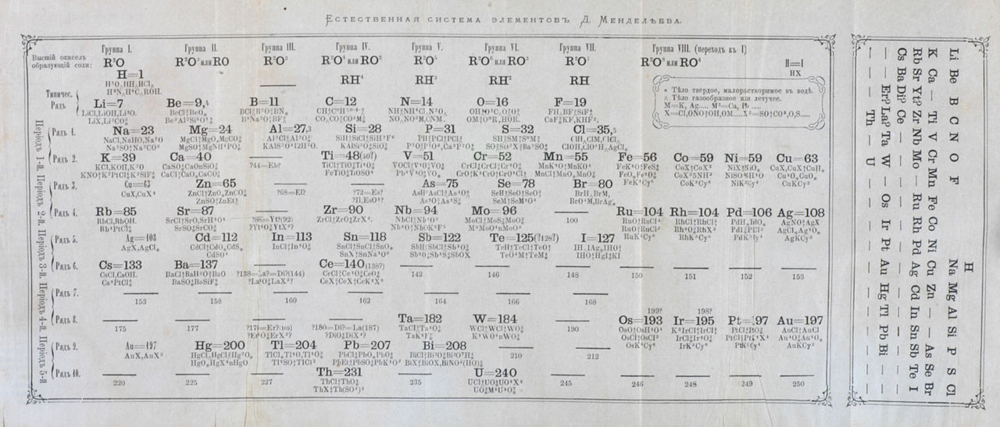

He wrote down a card for each known element (63 by that time) and attempted to sort them out by several criteria.

Mendeleev noticed the properties of elements were systematically related to their atomic mass. He arranged them so that groups of similar elements fell into vertical columns in his table.

This is how Mendeleev came up with a rudimentary version of the infamous Period Table of the Elements.

However… things were a bit off. Some elements did not fit well. Their properties did not match the properties of other elements in the same column.

The scientist, then, made a bold assumption. **He left some empty spaces** in the grid and pushed elements to the appropriate column. **He assumed he was missing something**. With that, he predicted that someone in the future would discover new elements that would fill the spots.

He turned out to be correct.

Actually, he was able to determine the properties of three elements that were yet to be discovered. Isn't that cool?!

## So what?

"So what" you might be thinking. "I know you. There's a hidden software metaphor somewhere, right?".

Of course, of course. We're getting there.

The exciting part about this story is that he noticed something didn't add up and turned it in its favor. He embraced the unknown, made room for them, and eventually everything fell into place.

He could predict other elements *because* he left spaces open in his periodic table for them. The model was valid *because* of its gaps.

He didn't expect to get everything right upfront. It was impossible.

He moved created a **complicated** scenario out of a **complex scenario** one (if this sounds like the [Cynefin framework](https://en.wikipedia.org/wiki/Cynefin_framework) is because it should. Got it from there).

In a complex domain, "*cause and effect can only be deduced in retrospect, and there are no right answers*". However, each experiment tells you things about the environment to which you respond.

In a complicated scenario, instead, there's a predictable solution. It may take a while to get there, but it exists. This was hardly the case when the Russian scientist tried to order all the elements on Earth.

## An example

I love it when during a planning session a business expert says, "*Oh, good question. Hadn't thought of that*". That's great because it means it is time to stop planning (I hate it).

Right at this point we understand we are in the realm of a **complex system**, where uncertainty is unavoidable.

This is what we do. Daily.

There's a gap between what we’d like to know and what we actually know. What do we do to mitigate this fear? Well, we request more detailed information.

I refuse to believe it is the best response, though. Instead, what about looking for feedback ([the shorter, the better](https://afontcu.dev/feedback-loops/))? Feedback from the users, the system, context, or a combination of them.

**Clarification by doing and inspecting**, not by planning.

Mendeleev did not ask for clarifications (maybe he did – I wasn't there, and I don't know that much about the man, to be honest). Instead, he assumed some stuff was missing and **used the gaps to build up the knowledge**.

We usually work in complex domains, too. It means we know where we're headed, and also that we should take small steps, get there, and then look back. We can expect two different outcomes by creating these feedback loops: it works (*yay*!), or we need to change direction (*yay*!, too. We got there the cheapest possible way).

In complex domains we’re experimenting and can’t plan what will happen. Making an estimate is impossible.

## Coda: embrace unknowns, also when writing software

Software moves between being complicated and complex. We switch between them, depending on the business/product/feature/use case we're working on.

Understanding if we're dealing with a **complicated** problem or a **complex** one is paramount. This way, we'll be able to approach them with the right tools and mindset.

Complicated problems can be solved but need expertise. An expert can look into it and come up with one (of many) solutions.

On the other hand, a complex problem is made of unknown unknowns. Trying to figure them out before making the first move is… well, it won't happen.

Bottom line: More often than not, leaving a gap is the smart (cheapest) move.

Learning to live with it is another story. You need to fight against [the fear of not having everything under control](https://afontcu.dev/fear/).
