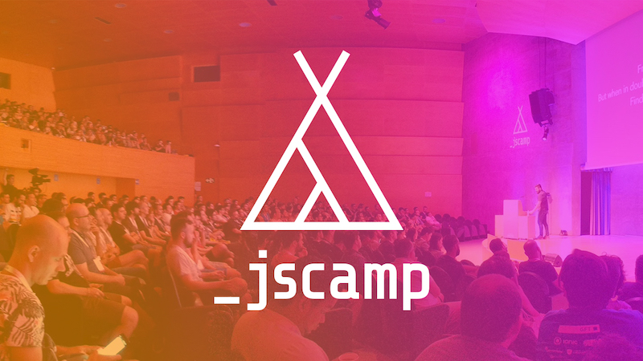

A year ago, in my [JSCamp 2018 recap](https://afontcu.dev/jscamp-bcn-2018/), I listed some of the best talks. You might notice that most of them were "technical". That's totally expected, right?

This year, however, things were a bit different.

While debreafing the event, my former colleague [Xavi](http://twitter.com/xevops/) and I noticed some recurring topics. And those weren't the topics you'd expect from a JavaScript conference.

So here's the trend we noticed:

[Kyle Simpson](http://twitter.com/getify/), author of [You Don't Know JavaScript](https://github.com/getify/You-Dont-Know-JS) and the [workshop I attended at Trivago HQ](https://afontcu.dev/trivago-javascript-kyle-simpson/), talked about progressive enhancement, and how the term hasn't... aged well. In contrast, he proposed to go back to roots, and focus on **empathy to empower people** (not "users") because we have the tools to make it happen. In Kyle's words, we should become **people advocates**. I couldn't agree more.

Then, [Sean Larkin](https://twitter.com/thelarkinn) shed some light on his role of advocating performance in a huge company. Microsoft; you might have heard of them before. So he was talking about (his) **users' experience**: they happen to be developers, but they are his users after all.

[Garance Flore](https://twitter.com/garancevallat) discussed accessibility in common UI patterns (unfolding menus, consecutive modals). So, again, she tried to teach us ways of showing **empathy** to whoever is using the keyboard to navigate our apps.

Even [Shawn Wang](https://twitter.com/swyx), from Netlify, explained to us how web development evolved to provide a **better development experience**. The goal?To let us focus on delivering.

Talking about delivering efficiently. In what could've been a simple showcase of [Svelte](https://svelte.dev/), [Rich Harris](https://twitter.com/Rich_Harris)' talk turned out to be an **ethical-based**, thought-provoking lecture about how to do more and write less. I can't recommend it enough.

Finally, [Henri Helvetica](https://twitter.com/HenriHelvetica) nailed a retrospective of the web. He urged us to remember things we shamefully forgot: **collaboration, inclusiveness, accessibility**.

Do you see the trend, there? I even highlighted several words. Connect the dots.

So, no: **JSCamp wasn't (only) about JavaScript**. We focused on the people using our apps, and how to provide them with better tools and experiences. 

It felt great.  

## Make no mistake; it was about JavaScript, too

This is not to say the conference wasn't "technical". We had a good dose of error handling, V8 internals, algorithmic performance, PWAs, CSS in JS, and iterators. The part you'd expect from a regular JavaScript conference.

By the way, I love single-track conferences. No more "am I choosing the right talk?" thoughts. No more "Where should I go next?". Quality over quantity. One less thing to worry about. We could call it atendee experience (see what I did there?).

