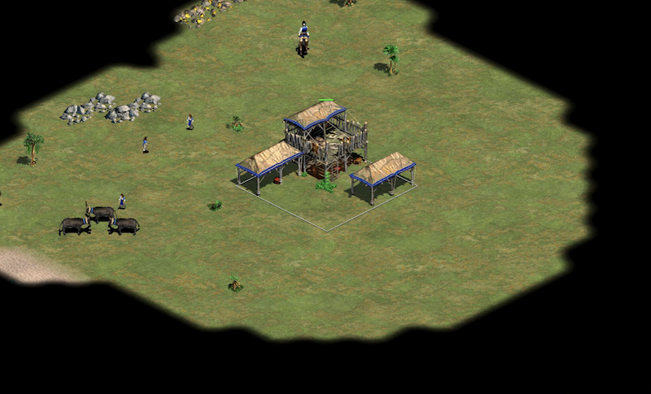
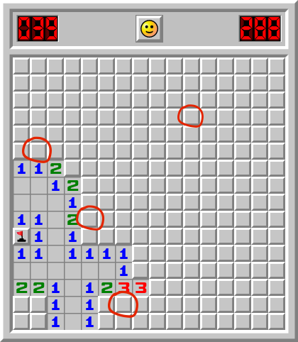
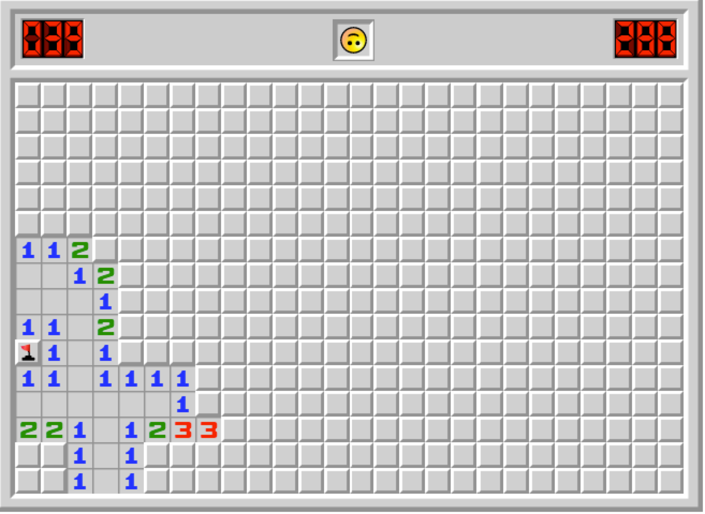

We plan the features we want and how we're gonna build them. And we assume we'll be able to get them and that they will work as expected.

*"We need to do X; it will drive more sales".*

*"We need to do X; it will reduce support tickets".*

*"We need to do X; it will make Y process faster".*

*"We need to do X; it will help team Y".*

Does these ring a bell?

I grant you that these goals sound good but are based on hope. And the truth is that nobody knows if you'll reach them.

And what's the typical answer when something doesn't work as expected?

*"Well… requirements changed".*

Things came up. Nothing went according to plan. Shit happened. Right?

## Changing requirements?

Now, hear me out.

This might sound weird, but I believe **requirements don't change**.

The problem is that when we start working on something, the path seems clear. We know what we need to do, and we know how to do so. Or, at least, we think we do.

But then reality kicks in: we start facing **unexpected issues and problems** here and there. They are usually small, but they add up.

*"Wait, we didn't know, but it turns out…"*

*"Wait, we assumed we would have X?"*

*"Wait, this thing does X? We expected Y"*

*"Wait, X worked for us, but someone told us X is gonna be Y in two weeks. Are we still good?"*

*"Wait, what? Did we need to do X? This means a lot of rework. Why didn't you tell us sooner?"*

Or my all-time favorite: "*Wait, was X even working?*".

## Nah, requirements didn't change

Notice that the business problem is still the same. Nothing changed; those blockers were already there!

What does change is **our understanding of the context**. It is not until we start untangling things up that we face reality.

No matter how hard you try to prevent these minor problems. There's no amount of experience or [seniority](https://afontcu.dev/senior-developer-meaning/) enough to avoid them. The only way to discover what's there is by advancing.

<figure class="figure">
  
</figure>

The only way to cross this minefield of tiny problems is to improvise, communicate, and **get [feedback as soon as possible](https://afontcu.dev/feedback-loops/)**.

## The minefield of software development

Imagine you were playing Minesweeper.

Would you use a Gantt chart to win? No, right? Nah.

<figure class="figure" style="max-width:400px">
  
</figure>

You would use every hint you could get instead of setting a plan from the very beginning. You would go one step at a time: click on a square, see how the landscape change, act accordingly.

Notice the mental model here because **software development works the same way**.

1. Assess the current situation.
2. Take a step, the smallest possible one that gives helpful information.
3. Reflect on what you just learned. What changed? What did go well?
4. Go back to step 1.

<figure class="figure" style="max-width:400px">
  
</figure>

Now, this won't make you "faster" from an output point of view.

But who cares? [This is not about going faster](https://afontcu.dev/shoe-factory-build-software/). This is about discovering where we're going. Software is about exploring.

Everything else is wishful thinking that looks good on a roadmap or a presentation. These are tools to overcome [fear](https://afontcu.dev/fear/), but they are based on hope. In fact, they are dangerous because they are hopeful: people feel safe around them. But hope is a poor shield against a mine.

## The Observer's paradox

There's a subtle but critical difference between Minesweeper and software development, though. Turns out the metaphor isn't that perfect!

When you play Minesweeper, the map doesn't change. You simply reveal it.

However, exploring the software development minefield modifies the map itself. It's a materialization of the Observer's paradox: **the layout we need to cross is modified by the team exploring it**.

Software development is a tangled web of of interactions, dependencies, relationships. Adding, changing, or removing any part of a system might generate a whole new category of these small problems.

There's no way we can predict it beforehand. By exploring the territory, **the map has effectively changed**.

Imagine a Minesweeper where every click makes the layout grow.

<figure class="figure">
  
</figure>

This is why a "stakeholder" handing off a specification doesn't work. It will never work on [a complex scenario](https://afontcu.dev/embrace-unknowns/).

## Kill all hope

The only way to cross a minefield is one step at a time. You may hope other tools will help, but they are only based on that: hope.

Developing with agility ([I refuse to say Agile](https://afontcu.dev/agile-is-dead/)) is about killing hope – the hope that things might work as expected.

It won't help you get there and reach your goals a 100% of the times; it's not magic, after all. However, **it will destroy the illusion that getting there is even possible** if it's not.

And then we're in the right place to start talking.
