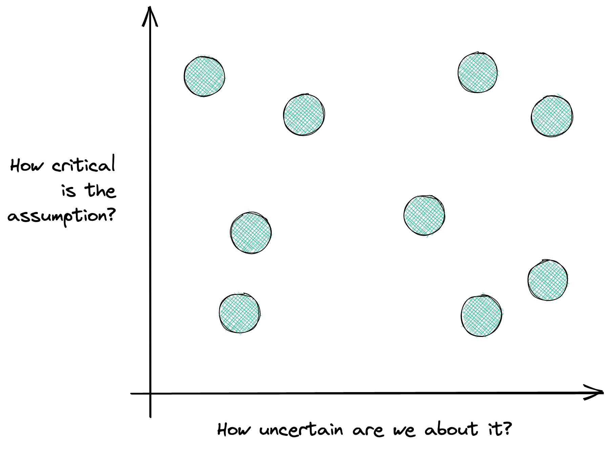
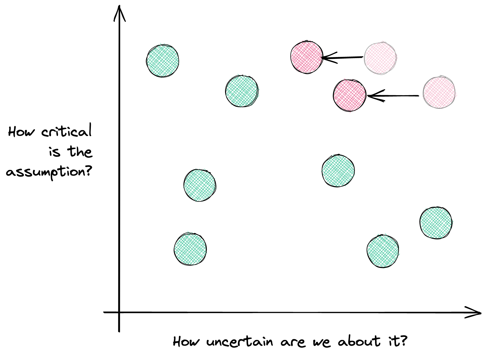

Do you know this cool new feature? **Unfortunately, users won't use it**.

Do you know this excellent new UI design you just crafted? **Unfortunately, users won't get it**.

Do you know this great function you just wrote? **Unfortunately, it won't work as expected**.

It is not a positive point of view; I grant you that. Why being so negative? We could be optimists and hope that…

…that this six-month project is going to be delivered on time.

…that users need that feature, and it is easy enough to get it done.

…that these nested `if` statements will work as expected, and we won't miss any edge case.

Let me ask you: whenever you say those things, are you sure about them?

## What if we assume we're going to be wrong?

Instead of hoping, we could…

…admit that we don't know if that feature will be helpful.

…acknowledge that we don't know how to code that feature.

…assume that our ideas, projects, goals, and visions are built upon **assumptions**.

The reality is that we're usually wrong. Heck, we're wrong even when we think we're right! [Here's a list of cognitive biases](https://en.wikipedia.org/wiki/List_of_cognitive_biases) that prove we don't even notice when we're wrong.

## Mistake-first product development

Things are no longer sure; they are merely **possible**. Therefore, we need to assume that being wrong is a potential outcome.

Now, this seems trivial, but it **changes everything**.

Seeing things this way means the **starting point of building software products is our assumptions**.

## An assumption is not an assumption

However, just like a [calorie is not a calorie](https://www.trainingpeaks.com/blog/a-calorie-is-not-a-calorie/), an assumption is not an assumption. They all are not the same.

Some assumptions are **critical**. If we're wrong, we're screwed. So we need to figure them out as soon as possible because they are the make-it-or-break-it type of assumption.

Others are **small beliefs** that won't derail the initiative or the feature we're working on.

Also, hypotheses always remain uncertain. We will never be 100% sure. Instead, we should focus on **settling with a higher degree of confidence**.

## "Am I certain enough?"

It depends on the information you have, but also how bad is to get it wrong.

Let's draw it.

That's good and what we aim for. We can't figure everything out at the beginning – it is the worst approach to tackle [a complex problem](https://afontcu.dev/embrace-unknowns/).

Instead, the goal is to **increase the confidence in critical assumptions**.

If everything is uncertain, there's only one thing to do: look for **quick, cheap feedback that proves us wrong** (or right).

That's why I don't care about A/B testing button colors if we don't know our product is valuable and worth the money.

That's why I don't care about writing good end-to-end tests for a feature I can't tell users are going to use.

These are local optimizations. And **local optimizations are the root of all evil**.

## "What can we do to get some quick feedback on this?"

That's the decisive question.

There's always risk associated with these hypotheses. The smart move here is to embrace it and address it as early as possible.

And we know how to answer that question. That's why we write tests when coding, define A/B tests, use trap doors, interview users. [These are all feedback loops](https://afontcu.dev/feedback-loops/) that provide answers.

## In a nutshell, be a pessimist

"*What could go wrong, here?*" is a great starting point when creating software products. It works at so many levels! From a tiny code function to a minor feature, a significant initiative, and a whole quarter goal.

When there's nothing left to go wrong, then you're right.

The mental model here is that **we base all our decisions on assumptions**. They are the only way to move forward, but we need to be aware we're walking on thin ice.

The solution? **Find the cheapest, quickest way to reduce the uncertainty of critical assumptions until you feel confident**. Think in terms of risk-reduction instead of the final output.