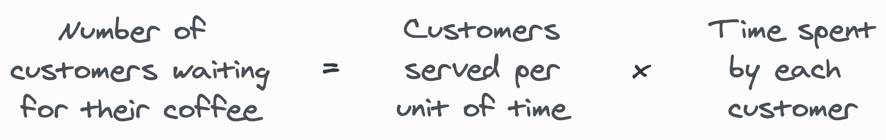

You know the drill: wou wait there a bit, order your espresso, pay for it, and get out. No big deal.

Simple workflow.

Here it is in all its glory:

## An example

Say the coffee shop receive an average of 60 customers every hour.

They could wait for an hour, collect all orders, brew every coffee, and deliver them. They would be working on 60 coffees at the same time.

It doesn't sound like a brilliant strategy, does it?

On the other hand, they could collect an order, have all the bartenders work on it, and deliver it as soon as it's ready. Then, take the next one.

That's… not cool (or smart, to be honest). Why would four people work on a single coffee? It is not *that* hard.

Sigh, every alternative sucks.

What are they doing wrong? What are we missing?

Well, this is where maths could help.

## A bit of logic

Let's think for a bit. You have 60 people arriving every hour.

Now, say it takes 6 minutes to serve the perfect coffee.

With that information, can we discover what's the number of customers that are gonna be waiting for their coffee?

The answer is **yes**.

Yes… as long as the system is stable, fluid, and some other stuff.

Number of customers waiting in line = 60 customers per hour * 0.1 hours (6 minutes) spent per customer = 6.

This is it! On average, the shop will have **6 customers waiting in line**.

How do I know that?

Because someone who was way smarter than me found (discover?) a theorem that maps to this situation.

This smart theorem is called [Little's Law](https://en.wikipedia.org/wiki/Little%27s_law). It states that the average **number of items on a queue** (our coffee shop) is equal to the average **time of arrival** to that queue multiplied by each order's average **waiting time**.

## So… back to our initial question

You should not work on a single coffee, but you shouldn't start working on 60, either. What's a sensible number?

The answer really **depends on the context**. But we know we expect an average of 6 customers waiting.

It is easy to see see how this information is helpful to decide how/when to collect a new order.

## Let's take a step back

Because something amazing just happened.

We said that "the number of items in a [stationary](https://en.wikipedia.org/wiki/Stationary_process) system is the product of the arrival rate and the time an item spends in the system."

Wait.

Isn't it…

…well…

…obvious?

## Yes, this is obvious

*Thank you for the confirmation, Mr. heading.*

Yes, folks, this is obvious. Nobody expects that adding more customers makes things faster, right?

In fact, we discovered that there are only two ways to reduce the time spent by our customers:

You either:

1. **Reduce the total amount** of customers waiting in the shop, or
2. **Increase the rate** at which they get out.

## We've known this for ages

Yes, we have!

It is 100% logical.

Then, **why do we keep managing software and teams by doing the exact opposite?**

"*But Adri, we don't*" – I can hear you saying.

"*Oh yes, yes we do*" – you should hear me saying.

We shove more features into a jam-packed backlog. It's like queueing more customers.

We make people switch context all the time – meetings, priorities, whatever. It's like asking the poor folk who's brewing the coffee to stop and sweep the floor.

We write architectures that are more unnecessarily complex. It's like using really complex coffee machines with a lot of buttons and gauges to make an espresso. Or worse: it's like building you own coffee machine!

## Enough with the coffee shop

*This turned into a software development metaphor. Surprise!*

As you might have guessed, the coffee shop is the team.

Also, customers are actually features.

So:

The average number of features within the system is our **work in progress** (WIP). It is measured in *"amounts of stuff"*.

The average amount of features passing into and out of the system is the **throughput** of the system. It is measured in *"amounts of stuff per unit of time"*.

Finally, the average amount of time a feature spends in the system is known as **lead time**. It is measured in *"units of time"*.

Soo, replacing concepts in the formula we discussed before…

Do you want features out sooner? That is, do you want a better (shorter) Lead Time?

Reduce the WIP, because it is **easier than increasing throughput**.

## But that's not what we do

We ask teams to go faster, put in more hours, close more tickets, start more projects, hire people.

We try to increase the throughput. More, more, more.

Instead, what if we reduced the number of things handled at the same time?

We would not be trying to go faster. [We would go less slow](https://afontcu.dev/slow/).

## A reinforcing loop

With a stable system and less work in progress, you get a shorter lead time…

…meaning throughput increases without working on "more" stuff…

…meaning you get slack time…

…which you can use to improve tools, processes, skills. Morale gets up. And all of these allow you to reduce the WIP.

## In short

Do you want to ship things quicker? Focus on the important ones and kill the others.

Focus on improving the flow of the system over its throughput. Make things run smooth, sharpen your tools, reduce the waste.

Focus on finishing stuff instead of starting new one.

Do it because it is way **simpler** (and cheaper) than increasing the rate at which your team completes stuff.